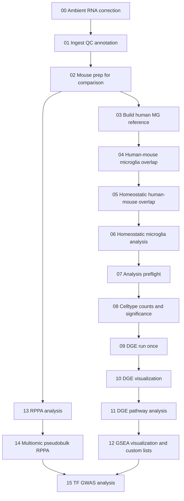

# Brain snRNA-seq Analysis Pipeline

End-to-end single-nucleus RNA-seq and multiomic analysis for brain datasets, implemented as a reproducible notebook pipeline.

This repository is intentionally prepared as a **professional code/notebook release**:
- analysis logic and notebook contracts are versioned
- large local data and generated results are excluded
- reproducible environment snapshots are included

## What This Pipeline Covers

- Ambient RNA correction
- Ingest, QC, integration, and annotation
- Cross-species microglia overlap and homeostatic analysis
- Counts, DGE, pathway, and GSEA downstream analysis
- RPPA preprocessing and RNA-RPPA integration
- TF-GWAS follow-up (Open Targets + Enrichr)

## Pipeline Stages

| Stage | Notebook(s) | Purpose | Key Outputs |
|---|---|---|---|
| 00 | `00_Ambient_RNA_correction.ipynb` | Ambient correction | `scAR/h5ad/*_scar_corrected.h5ad` |
| 01 | `01_Ingest.ipynb` | Ingest + QC + annotation | `adatas/*nb01*.h5ad`, `Mapping/mapping_output_nb01.csv` |
| 02 | `02_Mouse_PrepForComparison.ipynb` | Mouse prep for cross-comparison | `adatas/brain_*_allgenes.h5ad` |
| 03-05 | `03-05` (`.Rmd`) | Human reference + overlap mapping | Human and overlap reference artifacts |
| 06 | `06_Homeostatic_Microglia_Analysis.ipynb` | Homeostatic transfer/trends | NB06 analysis artifacts |
| 07 | `07_Analysis_Preflight.ipynb` | Handoff contract checks | Readiness checks for 08-15 |
| 08-12 | `08-12` (`.ipynb`) | Counts, DGE, pathway, GSEA | Differential and enrichment outputs |
| 13 | `13_RPPA_analysis.ipynb` | RPPA preprocessing | `RPPA/final_simple/for_multiomic/*` |
| 14 | `14_Multiomic_Pseudobulk_RPPA.ipynb` | RNA-RPPA integration | `Results/multiomic/*` |
| 15 | `15_TF_GWAS_Analysis.ipynb` | TF-GWAS and AD summary | GWAS/OT AD support outputs |

## Pipeline Diagram

The table above is the concise contract view. The diagram below shows the end-to-end analysis flow and where the RPPA branch rejoins the downstream interpretation path.



## Recommended Execution Order

1. `Notebooks/00_Ambient_RNA_correction.ipynb`
2. `Notebooks/01_Ingest.ipynb`
3. `Notebooks/02_Mouse_PrepForComparison.ipynb`
4. `Notebooks/03_Build_Human_MG_Reference_From_Prater_Green.Rmd`
5. `Notebooks/04_Human_Mouse_Microglia_Overlap.Rmd`
6. `Notebooks/05_Homeostati_Human_Mouse_Overlap.Rmd`
7. `Notebooks/06_Homeostatic_Microglia_Analysis.ipynb`
8. `Notebooks/07_Analysis_Preflight.ipynb`
9. `Notebooks/08_Celltype_Counts_and_SigDiff.ipynb`
10. `Notebooks/09_DGE_Run_Once.ipynb`
11. `Notebooks/10_DGE_Visualization.ipynb`
12. `Notebooks/11_DGE_Pathway_Analysis.ipynb`
13. `Notebooks/12_GSEA_Visualization_and_Custom_Lists.ipynb`
14. `Notebooks/13_RPPA_analysis.ipynb`
15. `Notebooks/14_Multiomic_Pseudobulk_RPPA.ipynb`
16. `Notebooks/15_TF_GWAS_Analysis.ipynb`

## Environment

Preferred Python runtime is `mlenv`.

```bash
mlenv
python -V
python -m pip install -r requirements.mlenv.lock.txt
```

R package/version snapshots are captured in:
- `R_sessionInfo.txt`
- `r_package_versions.txt`

## Validation

Before push/release:

```bash
python3 test_notebook_integrity.py
```

See `README_NOTEBOOK_VALIDATION.md` for details.

## Repository Layout

```text
Notebooks/                          # Primary analysis notebooks
README.md                           # Project overview and usage
README_NOTEBOOK_VALIDATION.md       # Notebook structural validation guide
test_notebook_integrity.py          # Integrity checker
requirements.mlenv.lock.txt         # Preferred Python lockfile
requirements.lock.txt               # Alternate Python lockfile
R_sessionInfo.txt                   # R session details
r_package_versions.txt              # R package versions
```

## Data and Licensing Notes

This repository is intended to share **code + notebooks + contracts**.
Large data files and generated outputs are excluded, but may be acquired through the associated publication.

Please cite and use third-party datasets/resources in accordance with their original licenses and terms.

