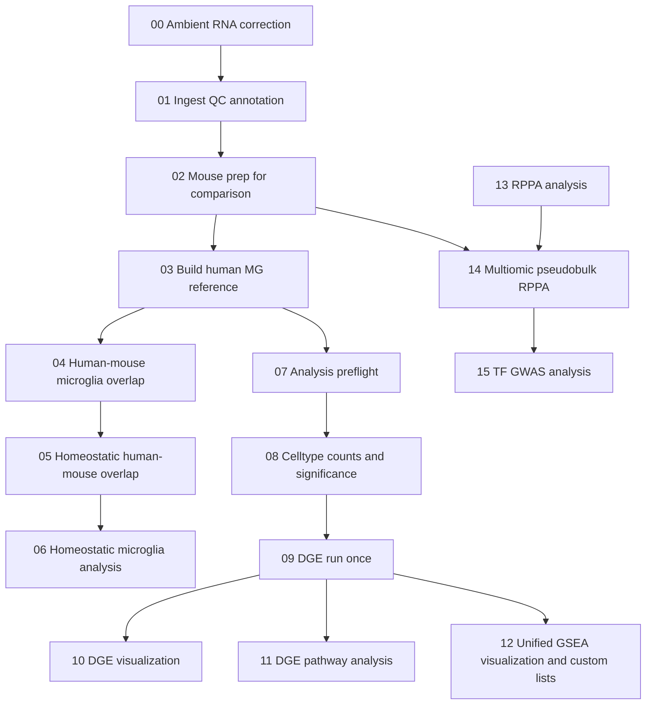

# Brain snRNA-seq Analysis Pipeline

End-to-end single-nucleus RNA-seq and multiomic analysis for brain datasets, implemented as a reproducible notebook pipeline.

This repository contains analysis code used for a manuscript currently in preparation. Full reference will be provided when
published.


## What This Pipeline Covers

- Ambient RNA correction
- Ingest, QC, integration, and annotation
- Cross-species microglia overlap and homeostatic analysis,ML model
- Counts, DGE, pathway, and GSEA downstream analysis
- RPPA preprocessing and RNA-RPPA integration
- TF-GWAS follow-up (Open Targets + Enrichr)

## Recommended Primary Input

For practical reruns, we recommend using the NB02-derived processed AnnData release artifacts, rather than rebuilding from raw ingest:
- `adatas/brain_allcells_allgenes.h5ad`
- `adatas/mouse_microglia_humanized_nb02.h5ad`

These are canonical outputs of `02_Mouse_PrepForComparison.ipynb`.

- `brain_allcells_allgenes.h5ad` is the preferred primary input for the downstream analysis branch and will be distributed through GEO once the manuscript is published.
- `mouse_microglia_humanized_nb02.h5ad` is the NB02 handoff object used by the cross-species reference/overlap branch (`03-06`).

Expected local placement for clone-and-run setups:
- Place starting AnnData handoff files in `adatas/`.
- Notebook 13 expects a preprocessed RPPA input table at `RPPA/RPPA_data.csv`.
- The canonical 2-way analysis scope is `NM0` and `OGM0` samples only.

## Data Availability and Recommended Start Point

For practical reruns, we recommend starting from Notebook 03 onward using the publication release artifacts, including the NB02-derived h5ad handoff files.

- The recommended processed mouse inputs will be released through GEO once the manuscript is published.
- The human reference itself will not be redistributed through GEO in this repository release; it is derived from the Prater Green PU.1 reference resource and should be obtained from the corresponding Synapse-hosted source.
- RPPA inputs used in the integrated branch will be packaged with the other mouse release data in the same GEO-associated dataset bundle.
- Notebooks 00 and 01 are included primarily for full transparency and provenance of the full end-to-end pipeline.
- Note: Notebook 00 (scAR ambient RNA correction) involves a stochastic process. The random state was not fixed in the released version of this notebook, so reruns may produce slightly different corrected counts. The NB02-derived h5ad release artifacts represent the exact objects used in the manuscript analysis and are the recommended reproducible starting point.

## Pipeline Stages

| Stage | Notebook(s) | Purpose | Key Outputs |
|---|---|---|---|
| 00 | `00_Ambient_RNA_correction.ipynb` | Ambient correction | `scAR/h5ad/*_scar_corrected.h5ad` |
| 01 | `01_Ingest.ipynb` | Ingest + QC + annotation | `adatas/*nb01*.h5ad`, `Mapping/mapping_output_nb01.csv` |
| 02 | `02_Mouse_PrepForComparison.ipynb` | Mouse prep for cross-comparison | `adatas/brain_*_allgenes.h5ad` |
| 03-05 | `03-05` (`.Rmd`) | Human reference + overlap mapping from NB02 handoff objects | Human and overlap reference artifacts |
| 06 | `06_Homeostatic_Microglia_Analysis.ipynb` | Homeostatic transfer/trends and MLP-based AD-like scoring | `Microglia_analysis/mouse_ad_like_probabilities_with_barcodes_nb06.csv`, `Microglia_analysis/model/*_nb06.*` |
| 07 | `07_Analysis_Preflight.ipynb` | Handoff contract checks | Readiness checks for 08-15 |
| 08-12 | `08-12` (`.ipynb`) | Counts, DGE, pathway, GSEA | Differential and enrichment outputs |
| 13 | `13_RPPA_analysis.ipynb` | RPPA analysis from canonical preprocessed input table | `RPPA/RPPA_data.csv`, `RPPA/for_multiomic/RPPA_nb14_ready_2way_m0_mockog.csv`, `RPPA/for_multiomic/RPPA_nb14_sample_mapping_mockog.csv` |
| 14 | `14_Multiomic_Pseudobulk_RPPA.ipynb` | RNA-RPPA integration | `Results/multiomic/*` (consumes `RPPA/for_multiomic/RPPA_nb14_ready_2way_m0_mockog.csv`) |
| 15 | `15_TF_GWAS_Analysis.ipynb` | TF-GWAS and AD summary | GWAS/OT AD support outputs |

## Pipeline Diagram

The table above is the concise contract view. The diagram below shows the end-to-end analysis flow, with the RPPA branch merging into notebook 14 and the DGE/pathway branch remaining separate from the multiomic and TF-GWAS branch.



## Recommended Execution Order

Recommended publication-style rerun:

1. Start at `Notebooks/03_Build_Human_MG_Reference_From_Prater_Green.Rmd` using the NB02-derived release artifacts `adatas/mouse_microglia_humanized_nb02.h5ad` and `adatas/brain_allcells_allgenes.h5ad`.
2. Continue through `Notebooks/04_Human_Mouse_Microglia_Overlap.Rmd`, `Notebooks/05_Homeostati_Human_Mouse_Overlap.Rmd`, and `Notebooks/06_Homeostatic_Microglia_Analysis.ipynb`.
3. Use `Notebooks/07_Analysis_Preflight.ipynb` to validate the downstream branch. Notebook 07 and the downstream all-cell analysis branch use `adatas/brain_allcells_allgenes.h5ad` directly.
4. Continue through Notebooks 08-15 as needed for counts, DGE, pathway, GSEA, multiomic, and TF-GWAS analysis.

Full provenance run:

1. `Notebooks/00_Ambient_RNA_correction.ipynb`
2. `Notebooks/01_Ingest.ipynb`
3. `Notebooks/02_Mouse_PrepForComparison.ipynb`
4. `Notebooks/03_Build_Human_MG_Reference_From_Prater_Green.Rmd`
5. `Notebooks/04_Human_Mouse_Microglia_Overlap.Rmd`
6. `Notebooks/05_Homeostati_Human_Mouse_Overlap.Rmd`
7. `Notebooks/06_Homeostatic_Microglia_Analysis.ipynb`
8. `Notebooks/07_Analysis_Preflight.ipynb`
9. `Notebooks/08_Celltype_Counts_and_SigDiff.ipynb`
10. `Notebooks/09_DGE_Run_Once.ipynb`
11. `Notebooks/10_DGE_Visualization.ipynb`
12. `Notebooks/11_DGE_Pathway_Analysis.ipynb`
13. `Notebooks/12_GSEA_Visualization_and_Custom_Lists.ipynb`
14. `Notebooks/13_RPPA_analysis.ipynb`
15. `Notebooks/14_Multiomic_Pseudobulk_RPPA.ipynb`
16. `Notebooks/15_TF_GWAS_Analysis.ipynb`

## Environment

Preferred local Python runtime is `mlenv`, but it is not strictly required if you use the provided Docker workflow or create an equivalent Python 3.10 environment with the documented dependencies.

```bash
mlenv
python -V
python -m pip install -r requirements.mlenv.lock.txt
```

For containerized execution, use the Docker setup in this repository instead of reproducing the local `mlenv` directly.

### Tooling and Version Sweep (for Reproducibility)

To support reproducible reruns and Docker packaging, this repository now includes explicit environment/version manifests:

- `reproducibility/tool_versions.txt`: core CLI and Python package versions used in this pipeline
- `reproducibility/mlenv_python_version.txt`: active `mlenv` Python executable/version snapshot
- `reproducibility/mlenv_pip_version.txt`: pip version in `mlenv`
- `reproducibility/mlenv_pip_list_freeze.txt`: `pip list --format=freeze` snapshot
- `reproducibility/mlenv_pip_freeze_all.txt`: full `pip freeze --all` snapshot

The current lockfile for preferred Python dependencies is:
- `requirements.mlenv.lock.txt`

If you need to refresh the manifests after an environment update, run:

```bash
bash reproducibility/generate_version_manifests.sh
```

### Docker Packaging (mlenv-aligned)

Starter Docker build file:
- `docker/Dockerfile.mlenv`

Container dependency scope:
- Docker images intentionally install only project dependencies from `requirements.pipeline.txt`.
- The broader local environment lock (`requirements.mlenv.lock.txt`) is kept for workstation reproducibility but is not used for container builds.

Build:

```bash
docker build -f docker/Dockerfile.mlenv -t brain-snrnaseq:mlenv .
```

Run (open Jupyter on port 8888):

```bash
docker run --rm -it -p 8888:8888 brain-snrnaseq:mlenv
```

Notes:
- The Docker image is pinned to Python 3.10 to match `mlenv`.
- R package snapshots are documented in `R_sessionInfo.txt` and `r_package_versions.txt`.
- Container installs are intentionally pipeline-scoped via `requirements.pipeline.txt` (not the full workstation environment).
- The original local training/inference stack was developed against an AMD Radeon RX 6750 XT workflow (ROCm-enabled local environment). Docker images here default to portable CPU-compatible Python wheels for reproducibility across machines.

### Docker Packaging (Python + R Unified Runtime)

For running both `.ipynb` (Python and R kernels) and `.Rmd` notebooks in one containerized environment, use:

- `docker/Dockerfile.r-python`
- `docker/install_r_packages.R`
- `docker/preflight.sh`
- `docker/run_all_rmd.sh`
- `docker-compose.yml`
- `.dockerignore`

Recommended first-run sequence:

```bash
bash docker/preflight.sh
docker compose up --build
```

Build/run execution is intended to be performed manually in your local terminal.

Build manually:

```bash
docker build -f docker/Dockerfile.r-python -t brain-snrnaseq:r-python .
```

Run manually:

```bash
docker run --rm -it -p 8888:8888 brain-snrnaseq:r-python
```

Or with compose:

```bash
docker compose up --build
```

Inside this container:
- JupyterLab supports Python notebooks and R notebooks (`IRkernel` installed).
- R Markdown notebooks can be rendered with:

```bash
Rscript -e "rmarkdown::render('Notebooks/03_Build_Human_MG_Reference_From_Prater_Green.Rmd')"
```

Or render all core Rmd stages from the running container:

```bash
bash docker/run_all_rmd.sh
```

This unified runtime is intended for reproducible execution across Notebook 00-15 plus the Rmd stages.

Hardware note:
- The reference local environment was built for an AMD Radeon RX 6750 XT (ROCm-oriented stack).
- The Docker configuration intentionally prioritizes portability and reproducibility; if GPU acceleration is required, you should add a dedicated ROCm-enabled container profile for your host.

R package/version snapshots are captured in:
- `R_sessionInfo.txt`
- `r_package_versions.txt`

## Validation

Before push/release:

```bash
python3 test_notebook_integrity.py
```

See `README_NOTEBOOK_VALIDATION.md` for details.

## Repository Layout

```text
Notebooks/                          # Primary analysis notebooks
README.md                           # Project overview and usage
README_NOTEBOOK_VALIDATION.md       # Notebook structural validation guide
test_notebook_integrity.py          # Integrity checker
requirements.mlenv.lock.txt         # Preferred Python lockfile
requirements.lock.txt               # Alternate Python lockfile
requirements.pipeline.txt           # Pipeline-only Python dependencies for Docker
reproducibility/                    # Tool + environment version manifests
docker/Dockerfile.mlenv             # Starter Docker image for mlenv-aligned runtime
docker/Dockerfile.r-python          # Unified Python+R runtime image
docker/install_r_packages.R         # R package + IRkernel bootstrap script
docker/preflight.sh                 # Pre-run checks before docker compose
docker/run_all_rmd.sh               # Helper to render core Rmd stages in-container
docker-compose.yml                  # Compose entrypoint for unified runtime
.dockerignore                       # Build context exclusions for faster/leaner images
R_sessionInfo.txt                   # R session details
r_package_versions.txt              # R package versions
```

## Data and Licensing Notes

This repository is intended to share **code + notebooks + contracts**.
Large data files and generated outputs are excluded, but may be acquired through the associated publication.

When available, use the publication-linked release of `adatas/brain_allcells_allgenes.h5ad` and `adatas/mouse_microglia_humanized_nb02.h5ad` (Notebook 02 outputs) as the primary processed handoff inputs for this pipeline.

For repository-based reruns on a new system, ensure required handoff data are present at the expected paths:
- `adatas/` for starting AnnData handoff files.
- `RPPA/RPPA_data.csv` for the Notebook 13 RPPA input table.

Please cite and use third-party datasets/resources in accordance with their original licenses and terms.

Portions of documentation and code-polishing were assisted by AI tools and then reviewed by the authors.

